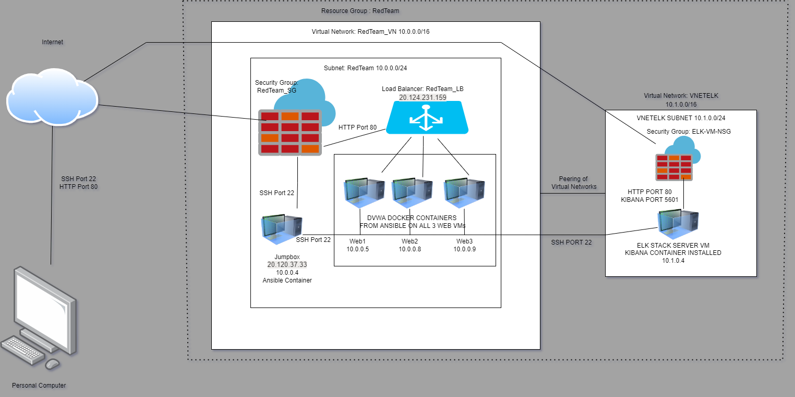
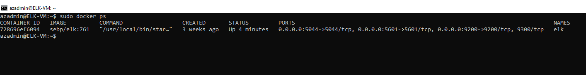

# DU CYBERSECURITY PROJECT 1 THOMAS LEONARD

DU cybersecurity project 1 for bootcamp

## Automated ELK Stack Deployment

The files in this repository were used to configure the network depicted below.

These files have been tested and used to generate a live ELK deployment on Azure. They can be used to either recreate the entire deployment pictured above. Alternatively, select portions of the ansible yml files may be used to install only certain pieces of it, such as Filebeat.

  
  
  

This document contains the following details:
- Description of the Topology
- Access Policies
- ELK Configuration
  - Beats in Use
  - Machines Being Monitored
- How to Use the Ansible Build

### Description of the Topology

The main purpose of this network is to expose a load-balanced and monitored instance of DVWA, the D*mn Vulnerable Web Application.

Load balancing ensures that the application will be highly available, in addition to restricting access to the network.
- Load balancers significantly help reduce the risk of a Denial of Service or Dedicated Denial of Service attack. This allows for the load balancer to distrubute traffic evenly among the three available web servers, making sure one server is not overloaded by high traffic, and can forward traffic to the least used server at the point a user accesses the web server. The advantage of using a jumpbox within the network is that it allows for easy setup of multiple servers using an ansible container to run a playbook on all available virtual machines, saving signficant time and resources by setting up the servers simultaneously. The jumpbox also creates an additional level of security before traffic reaches the servers.

Integrating an ELK server allows users to easily monitor the vulnerable VMs for changes to the event logs and system metrics.
- Filebeat will watch for log files or directories and create an easy way to foward and centralize them.
- Metricbeat collects metrics and statistics from the system and any services that are being run on your server, to help monitor for potential attacks or unusual activity on the web servers.

The configuration details of each machine may be found below.

| Name    | Function          | IP Address | Operating System |
|---------|-------------------|------------|------------------|
| Jumpbox | Gateway           | 10.0.0.4   | Linux            |
| Web1    | Web Server        | 10.0.0.5   | Linux            |
| Web2    | Web Server        | 10.0.0.8   | Linux            |
| Web3    | Web Server        | 10.0.0.9   | Linux            |
| Elk-VM  | Monitoring System | 10.1.0.4   | Linux            |

### Access Policies

The machines on the internal network are not exposed to the public Internet. 

Only the Jumpbox machine can accept connections from the Internet. Access to this machine is only allowed from the following IP addresses:
- Admin's Personal IP address

Machines within the network can only be accessed by the Jumpbox.
- Only the Jumpbox can access the Elk-VM, it's IP address is 10.0.0.4

A summary of the access policies in place can be found in the table below.

| Name               | Publicly Acessable | Allowed IP Addresses                                                                      |
|--------------------|--------------------|-------------------------------------------------------------------------------------------|
| Jumpbox            | Yes                | Admin's Personal Public IP Address                                                        |
| Load Balancer (LB) | Yes                | Admin's Personal Public IP Address (Can be updated to all traffic in practical situation) |
| Web1               | No                 | 10.0.0.4 (Also Via LB Public IP)                                                          |
| Web2               | No                 | 10.0.0.4 (Also Via LB Public IP)                                                          |
| Web3               | No                 | 10.0.0.4 (Also Via LB Public IP)                                                          |
| Elk-VM             | Yes                | Admin's Personal Public IP Address                                                        |

### Elk Configuration

Ansible was used to automate configuration of the ELK machine. No configuration was performed manually, which is advantageous because...
- Ansible will allow for the creation of a playbook through a yml scripting process. This allows for all servers to be configured simultaneously and also ensures all servers will be configured the same. In addition to being a more efficient and time saving method, it is also more accurate.

The playbook implements the following tasks:
- Installs Docker
- Installs Python-pip
- Installs Docker Python Module
- Increases virtual memory
- Downloads and launches a docker elk container

The following screenshot displays the result of running `docker ps` after successfully configuring the ELK instance.

### Target Machines & Beats
This ELK server is configured to monitor the following machines:
- Web1 (10.0.0.5)
- Web2 (10.0.0.8)
- Web3 (10.0.0.9)

We have installed the following Beats on these machines:
- Filebeat
- Metricbeat

These Beats allow us to collect the following information from each machine:
- Filebeat: Lightweight Log Analysis & Elasticsearch: Filebeat watches for log files and events. It will provide information on attacks if an actor was attempting to change certain log files, it will be time stamped and show the information to the person montitoring using the ELK server. 
- Metricbeat: Lightweight Shipper for Metrics: Metricbeat collects statistics and metrics from the services running on the server, as well as the operating system. It will track things like CPU usage, memory, and up/downtime information.

### Using the Playbook
In order to use the playbook, you will need to have an Ansible control node already configured. Assuming you have such a control node provisioned: 

SSH into the control node and follow the steps below:
- Copy the configuration files (filebeat-config.yml and metricbeat-config.yml)  file to /etc/ansible/files.
- Update the /etc/ansible/hosts file to include the internal IP address of the ELK server (10.1.0.4)
- Run the playbook, and navigate to http://(public_ip_of_elk_server):5601/app/kibana to check that the installation worked as expected.
- Which file is the playbook? Where do you copy it?
  - The playbook files are:   
  - 
  - 
  - 
  - These files will need to be copied to the /etc/ansible directory to be run.
- Which file do you update to make Ansible run the playbook on a specific machine? How do I specify which machine to install the ELK server on versus which to install Filebeat on?
  - You will need to update the etc/ansible/hosts.cfg file to run the playbook on a specific machine. In order to specify which machine, you will need put the IP of the machine under the correct section of the hosts configuration file to confirm which playbook will be run on which machine. 
- Which URL do you navigate to in order to check that the ELK server is running
  - http://(public_ip_of_elk_server):5601/app/kibana

As a **Bonus**, provide the specific commands the user will need to run to download the playbook, update the files, etc.
- ssh azadmin@(jumpboxip)
- (get ansible container name) sudo docker container list -a
- sudo docker start (ansible container name)
- sudo docker attach (ansible container name)
- cd etc/ansible
- ansible-playbook install-elk.yml
- cd etc/ansible 
- ansible-playbook filebeat-playbook.yml
- cd etc/ansible
- ansible-playbook metricbeat-playbook.yml
- Open http://(public_ip_of_elk_server):5601/app/kibana and enable metrics to confirm proper installation

- To download the beats configuration files, you will use curl -L -O (url of beats files) > /etc/ansible to download the config files for metric and file beat to copy the information to the webservers through the playbook, allowing them to properly monitor information from those servers. 
